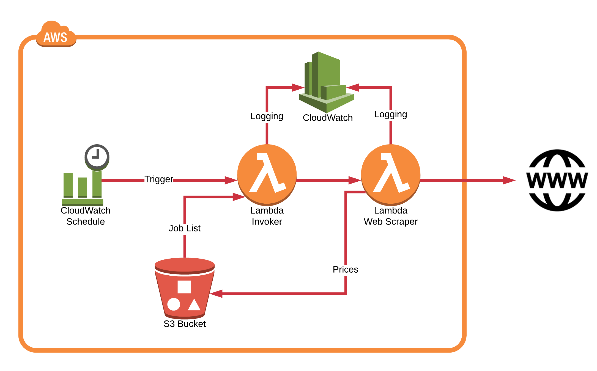

# AWS Lambda Price Grabber

## About

This is a project that creates a web scraper (or web crawler) to get the prices from online shops. You need to specify 
the exact product page. 

Two AWS lambda functions are used which are running python3 code. The first is reading a jobs file which looks up the 
list of URLs for scanning, then it triggers the second function which does the actual crawl and parsing for the price.

Note: the cloud watch trigger is manually setup.

The web scraper is found in one module called grabber.py. All AWS Lambda functions start with the prefix name lambda_ 
and the unit tests with test_ 

## Prerequisites 

### Developers Computer

The python in this repository runs under Python 3.6

It was developed this under the Ubuntu 18.04.1 LTS Operating system but should also work under Windows 10.

On the Linux command line, install and download using these 2 commands:

sudo apt-get install git 
git clone https://gitlab.com/neilspink/aws-lambda-price-grabber.git

To develop and test the AWS cloud formation templates you need to install the AWS CLI and for the second command
below be able to prove the region and a programmatic access information YOUR-SECRET-ID & YOUR-SECRET-KEY :

pip install awscli
aws configure

To run the crawler locally, you need to update/install the packages used by the program:

pip3 install -U -r requirements.txt requirements_unit_test.txt

## Getting started

Start by running the unit tests, if you ran the pip install from the prerequisites, then drop to the command line and 
just run the command:

nose2 

It should fail on one item 'test_logs_storage_s3.py', it is uploading a file to S3, rename the file by 
prepending the name with something like the word disable_

Get unit test code coverage using the command:

nose2 --with-coverage

To manually upload the source code to AWS, you would need all packages with the source code, so run we download them
to the source directory, after which you need to ZIP everything:

pip3 install -r ../source/requirements.txt -t ../source

### AWS Setup

In the AWS CloudFormation console or using the AWSCLI you need to run the file deployment/aws-create-foundation.json 
which will create the required roles for the AWS lambda functions and an S3 bucket.

If you use the following AWSCLI command, change the 'ParameterValue' which is the S3 Bucket Name. The name must be 
globally unique, no other AWS customer having the same name.

aws cloudformation create-stack --stack-name grabber-foundation  --template-body file://./deployment/aws-create-foundation.json --capabilities CAPABILITY_NAMED_IAM --parameters ParameterKey=S3BucketName,ParameterValue=aws-lambda-price-grabber
 
You need to update the S3 bucket name in the in the following files; aws-create-lambda.json, .gitlab.ci.yml & 
test_logs_storage_s3.py

### GitLab Setup

Once the AWS stack is created, you need to go into the AWS IAM console for the new user GitLab-deploy-price-grabber 
then under -> Security Credentials tab and "create access key".

Sign into GitLab, then settings -> CI / CD -> Variables and add AWS_ACCESS_KEY_ID & AWS_SECRET_ACCESS_KEY making them
protected and giving in the access key you just created.

Already mentioned, but you must update the .gitlab.ci.yml file with the S3 bucket name, after which you could in GitLab 
run the pipeline under CI / CD or using the commands in the following section.

In the CI file you at the deploy stage download the build artefact, and we could skip the packaging stage, but the code 
is in the source directory, and AWS lambda doesn't like that, i.e. 

curl --header "JOB-TOKEN':' $CI_JOB_TOKEN" -o source.zip https://gitlab.com/neilspink/aws-lambda-price-grabber/-/jobs/$CI_JOB_NAME/artifacts/download?job=$CI_JOB_NAME

## Lambda function input parameters on AWS:

The lambda functions can be run locally by going into the source directory, but they expect certain AWS resources to 
exist:

python3 lambda_price_grabber.py
python3 lambda_invoke_grabber.py

Event data is found at the end of each lambda_ function. You need to replace the "bucket_name" with your S3 bucket. The
invoke program requires the file source/website-monitor-list.yml to be in the S3 bucket too.

if __name__ == '__main__':
    events = {
        "bucket_name": "aws-lambda-price-grabber"
        ...
    }
      
## Commands for developing and testing the AWS cloud formation.

Do not use your AWS root account ever! You need to go into the AWS IAM console and create an admin user if you don't 
already have one. You need a pair of access keys which you can generate from the security credentials tab when looking
at the user profile.

These commands allow you to deploy as GitLab does and to develop it further. It is faster to use the CLI than wait on 
GitLab to do the job.

aws s3 cp ./test.zip s3://aws-lambda-price-grabber/

aws configure set default.region eu-central-1

aws configure set aws_access_key_id YOUR-SECRET-ID

aws configure set aws_secret_access_key YOUR-SECRET-KEY

aws cloudformation package --template-file ./deployment/aws-create-lambda.json --s3-bucket aws-lambda-price-grabber --output-template template-export.yml

aws cloudformation deploy --template-file template-export.yml --stack-name aws-lambda-price-grabber-stack --capabilities CAPABILITY_IAM

aws cloudformation delete-stack --stack-name aws-lambda-price-grabber-stack

## Blog posts

The project was developed over 8 weeks, each week of development a blog was posted and the GIT repository tagged.

https://www.clouded.ch/lambda-web-scraper-project-week-1/ | https://gitlab.com/neilspink/aws-lambda-price-grabber/tags/week1
https://www.clouded.ch/lambda-web-scraper-project-week-2/ | https://gitlab.com/neilspink/aws-lambda-price-grabber/tags/week2
https://www.clouded.ch/lambda-web-scraper-project-week-3/ | https://gitlab.com/neilspink/aws-lambda-price-grabber/tags/week3
https://www.clouded.ch/lambda-web-scraper-project-week-4/ | https://gitlab.com/neilspink/aws-lambda-price-grabber/tags/week4
https://www.clouded.ch/lambda-web-scraper-project-week-5/ | https://gitlab.com/neilspink/aws-lambda-price-grabber/tags/week5
https://www.clouded.ch/lambda-web-scraper-project-week-6/ | https://gitlab.com/neilspink/aws-lambda-price-grabber/tags/week6
https://www.clouded.ch/lambda-web-scraper-project-week-7/ | https://gitlab.com/neilspink/aws-lambda-price-grabber/tags/week7
https://www.clouded.ch/lambda-web-scraper-project-week-8/ | https://gitlab.com/neilspink/aws-lambda-price-grabber/tags/week8

There are a bunch of videos that go with this 'Python web scraper project' too.

https://www.youtube.com/playlist?list=PL67_9ze31skoKRh-h0BMtukzC41Ossj8p
